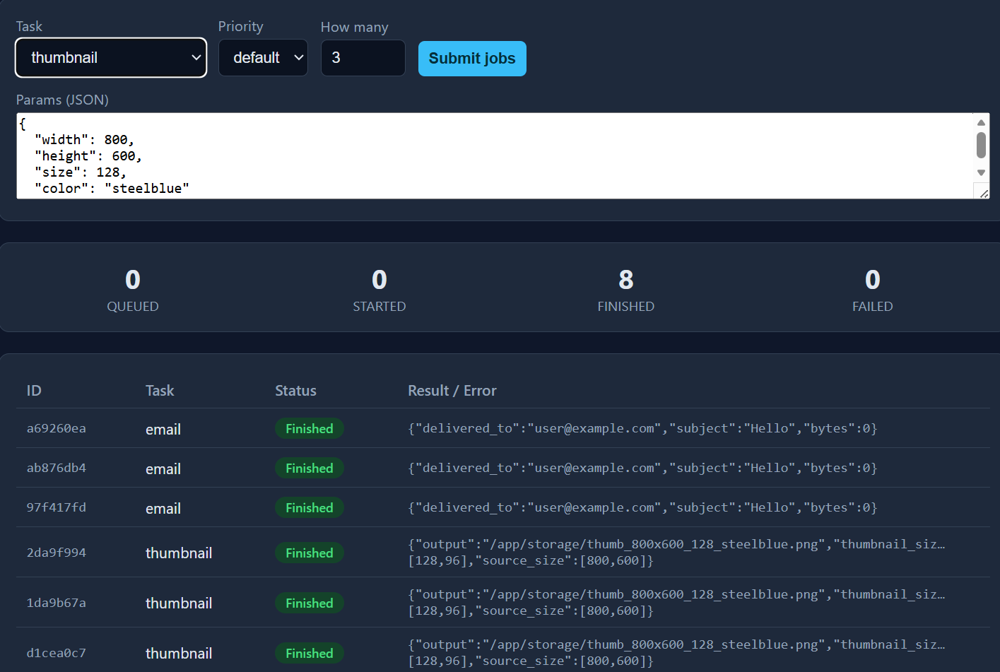

# Distributed Task Queue System

> A production-style job queue: submit work over a REST API, process it on horizontally-scalable
> workers, and track every job's status live — built with **FastAPI · Redis · RQ · React · Docker**.

[](https://github.com/CharanNaidu16/Distributed-Task-Queue/actions/workflows/ci.yml)


---

## Demo



The dashboard lets you submit jobs (single or in bursts), watch them move through
`queued → started → finished/failed` live, see per-status counts, and manually retry failed jobs.

---

## Why this project exists

Accepting a request and *doing the work* are two different speeds. A web request should return in
milliseconds, but real work (processing an image, crunching a CSV, calling an email provider) is slow
and can fail. A **task queue** decouples the two: the API accepts the job instantly and hands it to a
queue; independent **workers** pull jobs off the queue and run them. This is the backbone of nearly
every large system (payments, notifications, data pipelines).

---

## Features

**Core**
- **Job submission API** — `POST /jobs` validates input with Pydantic and returns `202 Accepted` instantly.
- **Worker system** — RQ workers consume jobs; run many at once with `--scale worker=N`.
- **Retry with backoff** — failed jobs retry up to 3 times (`10s, 30s, 60s`), then land in a dead-letter (failed) registry.
- **Job status tracking** — `GET /jobs/{id}` and `GET /jobs` expose status, result, error, and retry budget.
- **React dashboard** — live-updating table (2s polling), status badges, stats bar, manual retry button.
- **Priority queues** — `high / default / low`; workers drain them in priority order.
- **Mixed realistic tasks** — image thumbnailing (CPU), CSV aggregation (data pipeline), mocked email (fails on purpose to demo retries).

**Roadmap / stretch** — Prometheus + Grafana metrics, API-key auth, idempotency keys, WebSocket push updates, PostgreSQL job-history audit log.

---

## Architecture

```
 Browser ─► React SPA ─►  FastAPI (producer) ─enqueue─►  Redis (queue + results)  ◄─pop/result─  RQ Workers ×N
                              ▲                                      │
                              └──────────── status / list ──────────┘
```

Four services, one command. The **API** and **worker** share a single Docker image (same code,
different start command) — only the producer/consumer role differs. See [docs/architecture.md](docs/architecture.md)
for design decisions and trade-offs.

---

## Tech stack

| Tool | Why |
|------|-----|
| **FastAPI** | Async Python API with automatic validation + OpenAPI docs at `/docs`. |
| **Redis** | In-memory data store acting as the queue and result backend — fast and simple. |
| **RQ (Redis Queue)** | Battle-tested queue library; far less boilerplate than Celery for this scope. |
| **React + Vite** | Fast, modern SPA for the live dashboard. |
| **Docker Compose** | One-command orchestration of all four services. |
| **GitHub Actions** | CI: lint + test backend, build frontend, build images. |

---

## Quickstart

```bash
git clone https://github.com/CharanNaidu16/Distributed-Task-Queue.git
cd Distributed-Task-Queue
cp .env.example .env
docker-compose up --build
```

Then open:
- **Dashboard:** http://localhost:8080
- **API docs (Swagger):** http://localhost:8000/docs
- **Health:** http://localhost:8000/health

No manual Redis or Python install needed — Docker pulls and runs everything.

---

## API reference

| Method | Path | Description |
|--------|------|-------------|
| `POST` | `/jobs` | Submit a job: `{ "task": "thumbnail", "params": {...}, "priority": "default" }` → `202` + `job_id` |
| `GET`  | `/jobs` | List recent jobs + per-status counts |
| `GET`  | `/jobs/{id}` | Get one job's status, result, and error |
| `POST` | `/jobs/{id}/retry` | Requeue a failed job from the dead-letter registry |
| `GET`  | `/health` | Liveness + Redis connectivity |

```bash
# Submit a thumbnail job
curl -X POST http://localhost:8000/jobs \
  -H "Content-Type: application/json" \
  -d '{"task":"thumbnail","params":{"width":800,"height":600,"size":128}}'

# Check status
curl http://localhost:8000/jobs/<job_id>
```

Valid tasks: `thumbnail`, `report`, `email`. Valid priorities: `high`, `default`, `low`.

---

## Scaling demo (the senior-engineer talking point)

```bash
docker-compose up --build --scale worker=3
```

Submit a burst of jobs (the dashboard form has a "How many" field). With 3 workers the queue drains
~3× faster than with 1 — the system scales horizontally with zero code changes. That's the whole point
of decoupling producers from consumers.

---

## Running tests

```bash
make test          # in Docker
# or locally:
cd backend && pip install -r requirements.txt && pytest -q
```

Tests use `fakeredis` (an in-memory Redis) and RQ's in-process `SimpleWorker`, so they need no running
services and pass on any CI runner.

---

## Design decisions & trade-offs

- **RQ over Celery** — RQ is lighter and easier to reason about; Celery's extra features (complex
  routing, multiple brokers) aren't needed here.
- **A task registry, not dynamic imports** — the API maps a *validated name* to a known function and
  never executes arbitrary code paths from client input (secure-coding decision).
- **Redis-only state** — RQ already tracks status/results in Redis. Durable history (PostgreSQL) is on
  the roadmap; it's the natural data-pipeline extension.
- **Polling over WebSockets** — 2s polling is simple and robust for a dashboard; push updates are a
  documented stretch goal.
- **At-least-once delivery** — retries mean a job can run more than once, so tasks are written to be
  idempotent (outputs derive from inputs).

---

## License

MIT — see [LICENSE](LICENSE).
